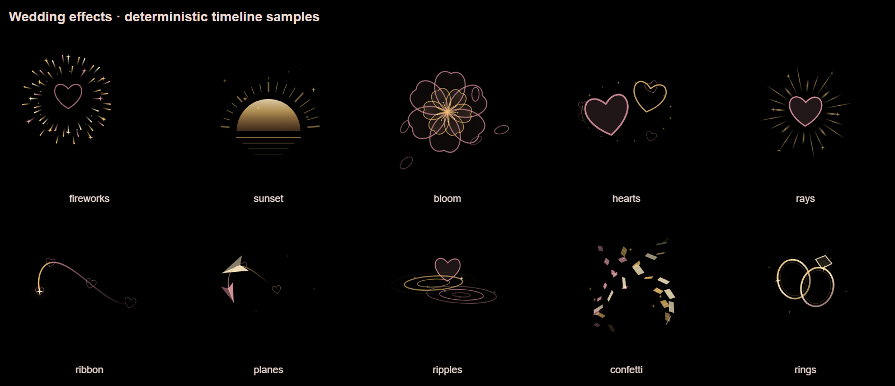

# 婚礼视频导演 · Wedding Film Director

从真实照片、视频、歌曲和参考片出发，制作随音乐发展的婚礼影片。

这是一个给 AI 编程助手使用的 **Skill**，包含导演流程、返工经验、素材与成片检查脚本，以及十种可复用 Canvas 特效。支持从零制作，也支持继续已有工程。

## 它解决什么

- **音乐卡点**：分析真实攻击点和乐段，明确照片落稳、转场揭开、烟花绽放等视觉事件的音乐落点。
- **参考片学习**：观看连续运动，拆解纸片支点、相位、照片接力和尾迹，不只看几张截图。
- **人物与构图**：保护脸、手臂、牵手、裙摆和鞋；不适合抠图时换照片或使用整张撕纸照片。
- **歌词与间奏**：核对实际演唱和重复句，间奏通过真实视频、原声、照片动作和意象发展。
- **特效设计**：完整展开、停留与收尾，可以跨镜头延续；保持照片、人物和文字清楚。
- **真实交付**：重新扫描原素材，检查实际可见时间，并从最终编码视频取证，避免“清单齐全、观众却没看到”。

纯黑纸片只是可选风格；可以延续自己的参考片、美术和现有渲染引擎。

## 安装与调用

将本仓库放入助手的 skills 目录，目录名为 `wedding-film-director`，确保其下直接包含 `SKILL.md`。

Codex 默认目录示例：

- Windows：`%USERPROFILE%/.codex/skills/wedding-film-director`
- macOS / Linux：`~/.codex/skills/wedding-film-director`
- 自定义 `CODEX_HOME` 时：`$CODEX_HOME/skills/wedding-film-director`

目录不存在时可克隆；已有同名技能请先比较版本，避免覆盖本地修改：

```sh
git clone https://github.com/qingyabailu-git/wedding-film-director.git ~/.codex/skills/wedding-film-director
```

然后在能识别该技能的新会话中输入：

> 使用 $wedding-film-director，根据我的照片、视频、音乐和参考片制作婚礼视频。先分析素材和音乐，沿用我认可的风格，输出经过检查的可播放成片。

局部修改也可以：

> 使用 $wedding-film-director，继续当前工程：换掉不自然的纸片人物，歌词保持左下角，延长烟花停留，并核对是否漏了照片。

若只想讨论，请明确说“先讨论，不开始制作”。

## 工具与依赖

阅读技能说明本身不需要安装 Python 包。执行辅助脚本需要 **Python 3.10+**，按需安装：

```sh
python -m pip install -r requirements.txt
```

另需 FFmpeg / FFprobe，可放在 PATH 中，也可通过脚本参数提供路径。特效模块使用现代浏览器的 Canvas 2D。实际成片可结合现有 HyperFrames、Remotion、HTML/GSAP 等工程，仓库不捆绑这些框架或承诺一键自动剪辑。

| 文件 | 功能 |
|---|---|
| [SKILL.md](SKILL.md) | 制作、讨论、返工与续作入口 |
| [参考片与叙事](references/reference-and-story.md) | 素材、文件改名、事实标题、连续运动分析 |
| [音乐与剪辑](references/music-and-editing.md) | 时钟、攻击点、歌词、间奏、原声混音 |
| [纸片与效果](references/paper-layout-effects.md) | 选图、完整身体、构图与效果生命周期 |
| [渲染与验收](references/render-and-qa.md) | 三层素材证据、实际画面与声音检查 |
| [工具与格式](references/data-and-tools.md) | 完整命令、输入格式、Canvas 接口 |
| [返工经验](references/case-lessons.md) | 反复修改中积累的问题与解决方法 |

### 四个辅助脚本

- `media_inventory.py`：原始目录清单、方向/时长、改名候选、排除与稳定 ID；不默认全量哈希。
- `music_map.py`：首声音、频谱攻击点与周期候选；不把自动结果当成已核实重拍。
- `reference_strip.py`：有限连续片段、采样序列与时间联系表。
- `audit_delivery.py`：声明覆盖、短曝光、空隙提醒、完整解码、最终取帧和点击定位索引。

### 十种 Canvas 特效

烟花、落日、花朵、双心、光芒、丝带、纸飞机、涟漪、纸屑、戒指。显式时间求值，可倒序定位，支持照片/人物/字幕保护区域。效果选择与位置仍需结合音乐和画面设计。



## 验证范围

已使用合成素材测试：稳定 ID 改名与排除、缺失素材、短曝光、非法时间、静音与已知节奏脉冲、连续参考片提取、含音视频文件完整解码、编码画面取证，以及十种特效的定位一致性和保护区域。

这些测试不意味着任意歌曲都能自动准确卡点，也不意味着清单检查可以识别最终画面中的人物。真实项目仍需看片、听音乐、核对歌词与逐项素材。

## 私人素材边界

仓库只包含通用流程、代码和合成特效示例，不包含任何情侣原照、个人视频、歌曲、实际歌词、私人路径或身份信息。把个人素材与输出保存在独立项目目录，发布工程前另行核查。
